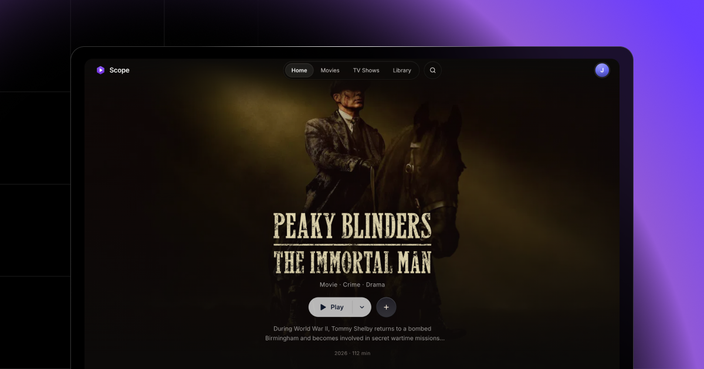

<p align="center">
  
</p>

<h1 align="center">Scope</h1>

<p align="center">
  A beautiful, modern web client for the Stremio ecosystem.
  <br />
  Browse, stream, and track — all from your browser.
</p>

<p align="center">
  <strong>⚠️ This project is currently in Alpha. Expect bugs and breaking changes.</strong>
</p>

<p align="center">
  
  
  
  
</p>

---

<p align="center">
  
</p>

## What is Scope?

Scope is a third-party web client that connects to the [Stremio](https://www.stremio.com/) addon ecosystem. It provides a polished, cinematic interface for browsing catalogs, discovering content, managing your library, and streaming — all powered by the open Stremio addon protocol.

**Scope is not affiliated with Stremio.** It's an independent client that speaks the same protocol.

## Features

**Browse & Discover**
- Catalogs from Cinemeta (Popular, Featured movies & series)
- Genre filtering and pagination on the Discover page
- Global search with `Cmd+K` / `Ctrl+K`
- "More Like This" recommendations on every detail page
- Cast pages with Wikipedia photos and filmography

**Streaming**
- Aggregates streams from all installed Stremio addons
- Smart auto-selection (prefers 4K, ranks by seeds, penalizes cam rips)
- Remembers your last chosen source per title
- Split play button — one click to play, dropdown to pick a source
- Stall detection with inline source switcher

**Player**
- Vidstack-powered video player with full controls
- Subtitle support via OpenSubtitles (SRT → VTT conversion)
- 2x speed on hold (spacebar or long-press)
- Next episode auto-play with 15s countdown
- Watch progress saved every 30 seconds

**Library & Sync**
- Sign in with your Stremio account
- Library, addons, and watch progress sync to the cloud
- Continue Watching on the home screen
- Resume playback from where you left off

**Addons**
- Install and manage Stremio addons
- Persisted to localStorage + cloud sync
- Works with any v3 addon (catalogs, streams, subtitles)

**Infrastructure**
- Custom streaming server URL (point to any machine on your network)
- Guided onboarding for first-time users
- Error boundaries, loading skeletons, toast notifications
- Mobile responsive
- View Transition API for smooth page navigation

## Getting Started

### Prerequisites

- [Bun](https://bun.sh/) (or Node.js 18+)
- [Stremio](https://www.stremio.com/downloads) desktop app running (for torrent streaming)

### Install

```sh
git clone https://github.com/scope-media/scope.git
cd scope
bun install
```

### Develop

```sh
bun dev
```

Open [http://localhost:5173](http://localhost:5173).

### Build

```sh
bun run build
```

Preview the production build:

```sh
bun run preview
```

## Architecture

```
src/
├── lib/
│   ├── api/
│   │   ├── stremio.ts        # Stremio addon protocol + cloud API client
│   │   └── smartSelect.ts    # Stream ranking algorithm
│   ├── components/
│   │   ├── Nav.svelte         # Navigation bar
│   │   ├── CommandPalette.svelte
│   │   ├── HeroBanner.svelte
│   │   ├── MediaCard.svelte
│   │   ├── MediaRow.svelte
│   │   └── StreamModal.svelte
│   └── stores/
│       ├── auth.svelte.ts     # Stremio account auth
│       ├── addons.svelte.ts   # Addon management
│       ├── library.svelte.ts  # Library + watch progress
│       ├── player.svelte.ts   # Player state + stream history
│       └── commandPalette.svelte.ts
└── routes/
    ├── +page.svelte           # Home
    ├── detail/[type]/[id]/    # Movie/series detail
    ├── discover/[type]/       # Browse with filters
    ├── player/                # Video player
    ├── library/               # User library
    ├── person/[name]/         # Cast detail
    ├── settings/              # Settings + addons
    ├── login/                 # Sign in
    └── welcome/               # Onboarding
```

## Tech Stack

| Layer | Technology |
|---|---|
| Framework | [SvelteKit 2](https://kit.svelte.dev/) + [Svelte 5](https://svelte.dev/) (runes) |
| Styling | [Tailwind CSS v4](https://tailwindcss.com/) |
| Video | [Vidstack](https://vidstack.io/) + [hls.js](https://github.com/video-dev/hls.js/) |
| Notifications | [svelte-sonner](https://github.com/wobsoriano/svelte-sonner) |
| Protocol | [Stremio Addon Protocol v3](https://github.com/Stremio/stremio-addon-sdk) |

## Streaming Server

Scope connects to a Stremio streaming server for torrent playback. By default it looks for `http://127.0.0.1:11470` (the Stremio desktop app's built-in server).

You can point it to a remote server in **Settings → Streaming Server** — useful for running one server on a NAS and connecting multiple clients across your network.

## Multi-User

Each browser profile maintains its own Stremio account session. Multiple users can share the same streaming server while keeping separate libraries, addons, and watch history.

## License

MIT
